# Raport de Analiză și Justificare Tehnică (Licență)
## Corelații de Date, Beneficii și Validare Experimentală

Acest document reprezintă un ghid metodologic pentru capitolul de **Analiză a Rezultatelor Experimentale** din cadrul lucrării de licență. El detaliază modul în care datele colectate timp de o săptămână de către Smart Home Hub sunt interpretate, cum justifică proiectul valoarea inginerească în fața comisiei și cum se poate demonstra grafic impactul automatizării.

---

## 1. Analiza și Interpretarea Datelor Istorice (7 Zile)

Prin interogarea bazei de date SQLite (`smart_home.db`) și extragerea telemetriei pe o săptămână, se pot evidenția trei fenomene fizice și cibernetice cheie:

### A. Evaluarea Inerției Termice a Clădirii
* **Metodologie:** Corelarea temperaturii interioare (măsurată de senzorul **Sonoff THR320**) cu temperatura exterioară (extrasă retrospectiv via API-ul Open-Meteo).
* **Fenomenul Fizic:** Se măsoară constanta de timp termică ($T$) a încăperii, adică timpul necesar pentru ca temperatura interioară să scadă cu $1^\circ\text{C}$ când încălzirea este oprită și temperatura exterioară este scăzută.
* **Justificare în Licență:** Această analiză demonstrează necesitatea unui algoritm de control cu **histerezis** (de exemplu, pornire la $21.5^\circ\text{C}$ și oprire la $22.5^\circ\text{C}$). Fără această zonă de tampon, releul s-ar comuta frecvent la variații de $0.1^\circ\text{C}$ (fenomenul de *chattering*), ducând la uzura rapidă a echipamentului de climatizare.

### B. Corelația Prezență – Iluminat Ambiental – Consum
* **Metodologie:** Suprapunerea logurilor senzorului de mișcare (radarul microcontrolerului **Wemos D1**) cu senzorul de luminozitate (Lux) și starea releului becului **Philips WiZ**.
* **Fenomenul Cibernetic:** Validarea regulii logice implementate în backend:
  $$\text{Stare Bec} = \text{ON} \iff (\text{Mișcare} = \text{True} \land \text{Lux} < \text{Prag})$$
* **Analiza Datelor:** În datele istorice se observă că în perioadele cu luminozitate naturală crescută (mijlocul zilei) sau în perioadele de absență (lipsă mișcare), becul rămâne stins chiar dacă utilizatorul a uitat comutatorul fizic pornit. Această corelație directă validează eficiența energetică a automatizării.

### C. Profilul de Încărcare Electrică (Load Profile) și Calitatea Energiei
* **Metodologie:** Analiza curentului ($A$), voltajului ($V$) și puterii active ($W$) înregistrate de priza inteligentă **Sonoff S60**.
* **Analiza Datelor:** 
  * Integrarea matematică a puterii pentru calculul energiei consumate:
    $$E = \sum (P \times \Delta t) \quad [\text{kWh}]$$
  * Monitorizarea stabilității rețelei: Identificarea fluctuațiilor de tensiune sub valoarea nominală de $230\text{V}$ în intervalele de consum maxim local. Sistemul acționează ca un nod de siguranță, decuplând consumatorii sensibili dacă tensiunea depășește pragurile critice.

---

## 2. Justificarea Valorii Inginerești în Fața Comisiei

Pentru a demonstra complexitatea proiectului, accentul trebuie mutat de la funcționalitatea vizuală la deciziile de arhitectură și securitate:

1. **Securitate la Nivel Local (Edge Computing):**
   * *Argument:* Controlul dispozitivelor Sonoff se realizează complet local, utilizând protocolul proprietar criptat **AES-128-CBC** (prin `pycryptodome` pe RPi). 
   * *Importanță:* Sistemul nu depinde de servere cloud externe (eWeLink/Tuya) care pot introduce latențe mari sau probleme de confidențialitate a datelor personale. Dacă conexiunea la Internet este întreruptă, casa rămâne 100% funcțională.
2. **Descoperire Dinamică și Autonomie (Self-Healing Network):**
   * *Argument:* Implementarea monitorizării mDNS (**Zeroconf**) permite rezolvarea dinamică a adreselor IP.
   * *Importanță:* Dacă routerul local reatribuie IP-uri prin DHCP (în urma unui restart sau expirare lease), managerul Python detectează instant noua adresă din pachetele de broadcast multicast și își actualizează socket-urile în memorie, eliminând necesitatea configurării manuale a IP-urilor statice.
3. **Proxy Securizat pentru Inteligență Artificială:**
   * *Argument:* Clientul mobil (Flutter) nu interoghează direct API-ul AI (Gemini). Totul trece prin Raspberry Pi ca proxy securizat.
   * *Importanță:* Cheia API este stocată în variabilele de mediu ale serviciului de sistem (`systemd`), prevenind expunerea acesteia în codul sursă al aplicației mobile. De asemenea, RPi-ul intermediază accesul la baza de date locală SQLite, furnizând contextul necesar pentru *Function Calling* în mod controlat.

---

## 3. Prezentarea Grafică a Beneficiilor Automatizării

Cel mai de impact grafic pentru susținerea licenței este cel care compară **Modul Manual** cu **Modul Automatizat** pe un interval reprezentativ de 24 de ore.

### Structura Graficului Recomandat (Axe Duble Y):
* **Axa X:** Timpul (00:00 - 24:00)
* **Axa Y Stânga:** Temperatura ($^\circ\text{C}$) și Lumina ($\text{Lux}$)
* **Axa Y Dreapta:** Puterea totală consumată ($\text{Watts}$)

### Vizualizarea Corelațiilor din Grafic:

```mermaid
gantt
    title Corelații Temporale și Comportament (Manual vs. Automatizat)
    dateFormat  HH:mm
    axisFormat %H:%M

    section Activitate Utilizator
    Acasă (Dimineața)           :done, 06:00, 08:00
    Absență (La muncă)          :active, 08:00, 17:00
    Acasă (Seara)               :done, 17:00, 23:00

    section Regim Manual (Risipă)
    Lumină uitată aprinsă       :crit, 08:00, 17:00
    Radiator pornit la maxim    :crit, 08:00, 17:00

    section Regim Automat (Eficient)
    Stingere automată la plecare :active, 08:00, 08:05
    Menținere bandă confort 22C :done, 17:00, 23:00
```

### Elementele Cheie ce trebuie Evidențiate pe Grafic:

1. **Zona de Risipă Energetică (Modul Manual):**
   * *Reprezentare:* O curbă de consum electric care rămâne constant ridicată ($\sim 1200\text{W}$) în intervalul **08:00 - 17:00** (când utilizatorul este plecat, iar senzorul de mișcare indică inactivitate).
2. **Zona de Eficiență (Modul Automatizat):**
   * *Reprezentare:* La ora **08:05** (la 5 minute după plecarea utilizatorului), consumul de putere scade brusc la **$0\text{W}$** deoarece releele Sonoff S60 și becul WiZ primesc comanda de oprire automată.
   * *Impact vizual:* Suprafața dintre curba manuală și cea automatizată se colorează în verde deschis, fiind marcată ca: **„Energie Economisită: ~35%”**.
3. **Stabilitatea Microclimatului (Zona de Confort):**
   * *Reprezentare:* 
     * În regim manual, curba temperaturii oscilează haotic (scade sub pragul critic când utilizatorul uită să pornească căldura sau depășește $26^\circ\text{C}$ când o lasă pornită nesupravegheată, irosind resurse).
     * În regim automatizat (regulile din [device_manager.py](file:///e:/smart_app/flutter_application_1/raspberry_pi/home/mrz/HubMQTT/device_manager.py)), curba temperaturii este menținută stabil în banda de confort termic ($21.5^\circ\text{C} - 22.5^\circ\text{C}$), radiatorul fiind pornit doar în reprize scurte și optime.
