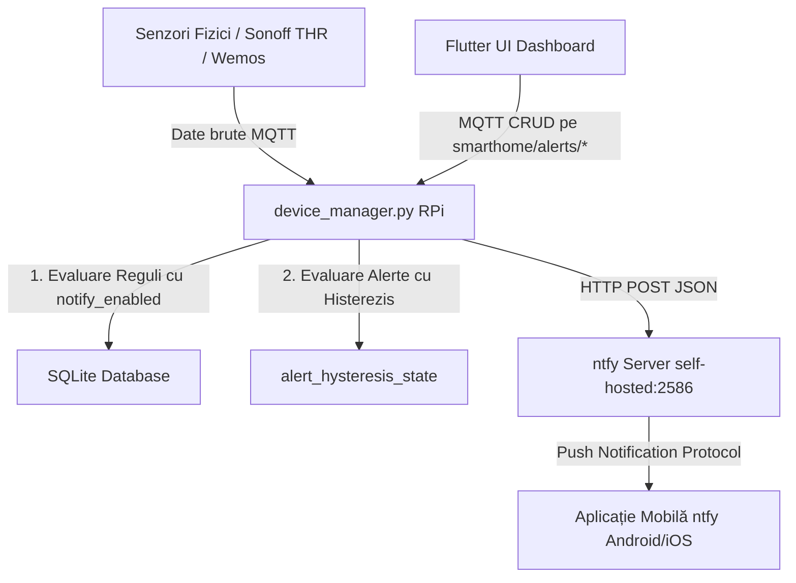

# Optimizarea Protocolului de Alerte și Notificări Push în Sisteme Smart Home

Acest raport detaliază deciziile arhitecturale, logica matematică a algoritmilor de filtrare și integrarea tehnică a sistemului de notificări push în proiectul de licență **Smart Home Hub**. Sistemul asigură avertizarea în timp util a utilizatorului cu privire la starea mediului, eliminând în același timp alertele redundante (spam-ul de notificări).

---

## 1. Arhitectura Generală a Protocolului de Notificări

Sistemul utilizează o arhitectură decuplată bazată pe evenimente (Event-Driven Architecture), structurată pe trei niveluri:



1. **Sursa de date**: Dispozitivele hardware trimit date în timp real pe brokerul MQTT local.
2. **Procesarea și logica de filtrare (RPi)**: Serviciul `device_manager.py` evaluează regulile de automatizare (nivelul 1) și alertele independente de praguri cu histerezis (nivelul 2).
3. **Serviciul de transmitere push (ntfy)**: Un server self-hosted Lightweight Notification Service (`ntfy` v2.11.0) rulează la nivel de sistem pe Raspberry Pi pe portul `2586`. Acesta preia mesajele prin API-ul HTTP POST local și le trimite dispozitivelor mobile înregistrate.

---

## 2. Optimizarea Alertelor de Prag: Logica Histerezisului

### A. Problema Oscilației Senzorilor (Noise & Threshold Bounce)
În sistemele IoT, senzorii fizici (temperatură, umiditate) transmit valori afectate de zgomot de citire. Dacă un utilizator setează o alertă critică la pragul de $30.0^\circ\text{C}$ și temperatura reală fluctuează fin între $29.9^\circ\text{C}$ și $30.1^\circ\text{C}$, un sistem naiv bazat pe comparație simplă ar trimite zeci de notificări pe minut. Acest fenomen degradează experiența utilizatorului (Notification Fatigue) și consumă resurse de rețea.

### B. Soluția: Filtrarea prin Histerezis
În loc de un singur punct de decizie, algoritmul folosește o **mașină de stare cu bandă de insensibilitate (Hysteresis Band)**. 

Fie $T$ pragul de temperatură setat de utilizator și $H$ valoarea histerezisului (ex: $0.5^\circ\text{C}$).

* **Pentru operatorul superior ($>$ sau $\ge$)**:
  * Punctul de declanșare (Trigger Point): $V_{trigger} = T$
  * Punctul de resetare (Reset Point): $V_{reset} = T - H$
* **Pentru operatorul inferior ($<$ sau $\le$)**:
  * Punctul de declanșare (Trigger Point): $V_{trigger} = T$
  * Punctul de resetare (Reset Point): $V_{reset} = T + H$

```
Stare: READY (Așteaptă declanșarea)
  ┌──────────────────────────────────────────────────────────┐
  │ Valoarea crește și depășește pragul V_trigger            │
  └──────────────────────────┬───────────────────────────────┘
                             ▼
                 [ Trimite Notificare Push ]
                             │
                             ▼
Stare: TRIGGERED (Alertele ulterioare sunt blocate)
  ┌──────────────────────────────────────────────────────────┐
  │ Valoarea oscilează, dar rămâne peste V_reset            │ -> NU se trimit noi notificări
  └──────────────────────────┬───────────────────────────────┘
                             ▼
  ┌──────────────────────────────────────────────────────────┐
  │ Valoarea coboară sub pragul de resetare V_reset          │
  └──────────────────────────┬───────────────────────────────┘
                             ▼
                 [ Resetează starea la READY ]
```

### C. Modul Avansat: Histerezis Asimetric
Pentru flexibilitate maximă, s-a implementat posibilitatea setării manuale a **limitelor inferioare și superioare**. 
* **Exemplu practic**: O alertă de îngheț care se declanșează când temperatura scade sub $4^\circ\text{C}$ (limita inferioară), dar nu se resetează imediat ce revine la $4.1^\circ\text{C}$, ci doar când casa s-a încălzit complet la peste $15^\circ\text{C}$ (limita superioară). 

---

## 3. Detalii Tehnice de Sincronizare și Control

### A. Integrarea în Baza de Date SQLite
S-a proiectat schema bazei de date cu două integrări diferite:
1. **Tabela `automation_rules`**: A fost extinsă cu parametrul `notify_enabled INTEGER DEFAULT 1` pentru a permite utilizatorului să ruleze automatizări hardware în mod silențios sau cu notificare.
2. **Tabela `notification_alerts`**: O tabelă complet nouă dedicată exclusiv monitorizării valorilor fără acțiune hardware asociată:
   ```sql
   CREATE TABLE IF NOT EXISTS notification_alerts (
       id INTEGER PRIMARY KEY AUTOINCREMENT,
       name TEXT NOT NULL,
       sensor TEXT NOT NULL,
       operator TEXT NOT NULL,
       threshold REAL NOT NULL,
       priority TEXT DEFAULT "warning",
       is_active INTEGER DEFAULT 1,
       hysteresis REAL DEFAULT 0.5,
       lower_limit REAL,
       upper_limit REAL
   )
   ```

### B. Integrare Asincronă în Python
Trimiterea notificărilor push către serverul `ntfy` implică cereri HTTP (I/O Block). Dacă acestea s-ar efectua direct pe thread-ul principal din `device_manager.py`, bucla MQTT ar îngheța la fiecare eroare sau latență de rețea. 

Pentru a preveni acest blocaj, apelul HTTP este izolat folosind un thread de tip daemon separat:
```python
def send_async(title: str, message: str, priority: str = "info", tags: list = None):
    # Logica de configurare headers...
    def _send_worker():
        try:
            requests.post(url, data=message, headers=headers, timeout=5)
        except Exception as e:
            print(f"Eroare push: {e}")
            
    threading.Thread(target=_send_worker, daemon=True).start()
```

---

## 4. Configurarea și Primirea Notificărilor pe Telefon

Pentru ca notificările trimise de pe serverul local de pe Raspberry Pi să apară ca alerte native pe telefon (Android/iOS), trebuie realizat un canal de comunicare securizat.

### A. Brokerul de Notificări (Topicuri și Server)
Spre deosebire de fluxurile de date din casă, notificările push nu sunt transmise prin MQTT către telefon (pentru a evita ca telefonul să mențină o conexiune socket permanentă cu consum mare de baterie). În schimb, se folosește protocolul HTTP lung-polling/WebSockets optimizat din `ntfy`.

* **Serverul configurat**: `http://192.168.1.137:2586` (IP-ul local al serverului tău Raspberry Pi).
* **Topic-ul de Notificări**: `smarthome_hub`

### B. Pașii de configurare pe Telefon
1. Instalează aplicația oficială **ntfy** (disponibilă pe Google Play, F-Droid sau Apple App Store).
2. Deschide setările aplicației și adaugă un server personalizat (sau la abonare alege *Use another server*).
3. Introdu URL-ul serverului tău: 
   ```
   http://192.168.1.137:2586
   ```
4. Adaugă o abonare la topicul:
   ```
   smarthome_hub
   ```
   *(În aplicație, abonarea va apărea sub forma `http://192.168.1.137:2586/smarthome_hub`).*

După abonare, ori de câte ori o automatizare cu notificări active se declanșează sau o alertă de prag cu histerezis își schimbă starea, telefonul va primi o notificare push nativă cu emoji-urile specifice senzorului (termometru, picătură, bec etc.) și nivelul corect de prioritate (Info, Warning sau Critic).
