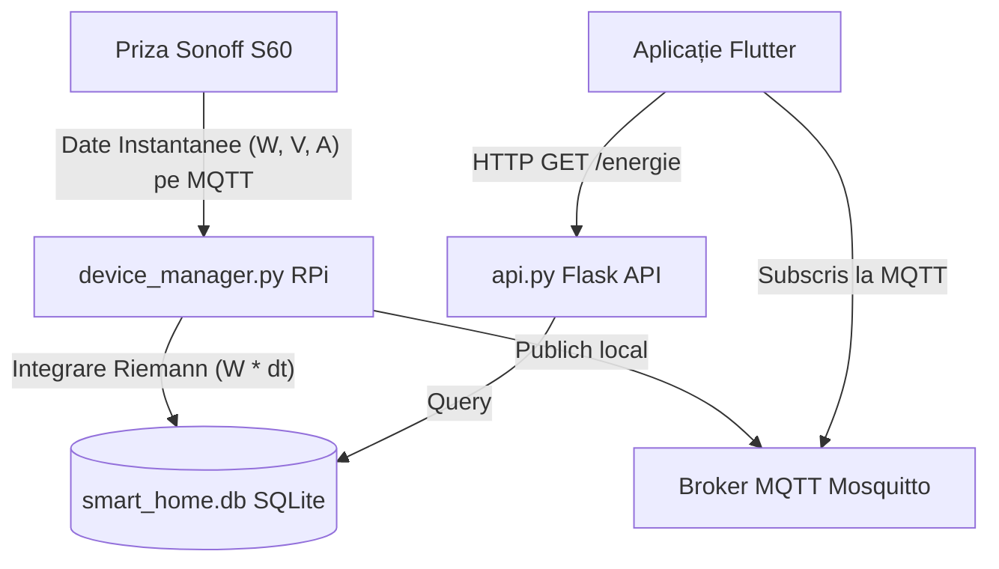

# Documentație Implementare: Monitorizare Energie (Sonoff S60) & Automatizări

Acest document detaliază arhitectura și modificările aduse sistemului de Smart Home (Raspberry Pi + Flutter) pentru a monitoriza consumul de energie al prizei inteligente **Sonoff S60**, a stoca istoricul în **SQLite**, a-l expune prin **Flask API**, și a integra suportul pentru reguli de automatizare pe bază de putere (W) și tensiune (V).

---

## 1. Arhitectură Tehnică & Flow Date



---

## 2. Servicii Backend (Raspberry Pi)

Toate serviciile rulează pe RPi sub controlul `systemd`. Căile mapate în Windows sunt accesibile prin unitatea de rețea `Z:`.

### A. Integrarea Energiei în `device_manager.py`
**Cale Windows:** `Z:\home\mrz\HubMQTT\device_manager.py`

* **Calcul consum:** Puterea instantanee ($W$) trimisă de priza S60 este integrată în timp folosind timestamp-ul curent pentru a obține energia în Watt-secunde, apoi convertită în Watt-ore (Wh):
  $$\Delta E = P \times \frac{t_{curent} - t_{anterior}}{3600}$$
* **Tabele SQLite (`smart_home.db`):**
  * `energy_totals`: Stochează totalurile cumulate pentru ziua curentă (`today_wh`) și luna curentă (`month_wh`). La startup, scriptul restaurează aceste valori din baza de date pentru a nu pierde progresul în caz de restart al serviciului.
  * `energy_log`: Înregistrează fiecare eșantion de putere în timp util pentru grafice de istoric fin.
* **Logică de Resetare (Daily/Monthly):**
  * La fiecare update MQTT, scriptul verifică dacă ziua curentă s-a schimbat față de `_last_reset_day`. Dacă da, trimite datele zilei către o tabelă de arhivă zilnică, resetează `energy_today_wh` la `0.0` și salvează noua stare.
  * Similar pentru lună, resetând `energy_month_wh` la `0.0`.
* **Automatizare reguli:** 
  După acumularea energiei, se apelează funcțiile de evaluare a regulilor de automatizare:
  ```python
  evaluate_rules("power", plug_power)
  evaluate_alerts("power", plug_power)
  evaluate_rules("voltage", voltage_val)
  evaluate_alerts("voltage", voltage_val)
  ```

### B. Endpoint-uri noi în `api.py` (Flask REST API)
**Cale Windows:** `Z:\home\mrz\Sonoff\api.py`
**Port:** `5000`

* **`GET /energie`**
  * Returnează consumul de azi în Wh și kWh, consumul pe luna curentă, puterea instantanee și costul estimat (calculat la un tarif de 0.80 Lei/kWh).
  * Include o listă `arhiva_zile` pe ultimele 30 de zile pentru a afișa un istoric zilnic agregat.
* **`GET /energie/istoric`**
  * Returnează ultimele 100 de eșantioane de putere din `energy_log`.

---

## 3. Modificări Frontend (Flutter)

**Workspace local:** `e:\smart_app\flutter_application_1`

### A. Serviciu de Date (`lib/api_service_v2.dart`)
S-au adăugat metode pentru interogarea endpoint-urilor Flask:
* `fetchEnergie()` -> returnează un model care conține consumurile de energie și costurile.
* `fetchEnergieIstoric()` -> returnează lista punctelor de putere pentru grafic.

### B. UI & Analytics (`lib/main_v2CLAUDE.dart`)
1. **Curățare Dashboard:** Rândul cu consumurile cumulate (Azi/Lună/Cost) a fost scos din cardul prizei de pe ecranul principal pentru a păstra designul aerisit. Acum cardul prizei afișează doar parametrii instantanei: Putere (W), Tensiune (V) și Curent (A).
2. **Mutare în Analytics & Grafic de Putere:** Datele cumulative de consum au fost mutate în ecranul de detalii `IstoricDetaliatScreenV2` sub secțiunea **ENERGY PROFILE — S60**. Ecranul a fost completat cu un **grafic de putere (W)** real-time și istoric, similar cu profilele de climă:
   * 3 carduri cu parametrii instantanei (Power, Voltage, Current).
   * Un card principal cu gradient pentru energia consumată azi, luna aceasta și cost.
   * Un grafic dinamic bazat pe `LineChart` (`fl_chart`) care afișează evoluția consumului instantaneu în Wați, folosind eșantioanele istorice primite de la `fetchEnergieIstoric()` la deschidere și actualizările în timp real primite prin MQTT.
3. **Automatizări pe bază de W și V:**
   * În drop-down-ul de creare reguli (`_AddRuleBottomSheetState`) au fost adăugate două opțiuni de senzori: `Putere Instantă (W) ⚡` și `Tensiune (V) 🔌`.
4. **Corecție control slider la tastare (TextFormField):**
   * Selectarea valorilor mici de W (ex: 5W, 50W) dintr-un slider liniar de 0-3500W este extrem de dificilă din cauza sensibilității tactile pe ecran.
   * Am înlocuit widget-ul `Slider` cu un `TextFormField` numeric când senzorul selectat este `power` sau `voltage`.
   * **Validare:** Se fac verificări în timp real:
     * Pentru `power`: Intervalul acceptat este `0 – 3680 W` (3680W fiind puterea maximă suportată de o priză standard EU de 16A la 230V).
     * Pentru `voltage`: Intervalul acceptat este `180 – 260 V`.
   * Clamping-ul automat de build a fost dezactivat pentru acești doi senzori pentru a nu suprascrie valoarea în timp ce utilizatorul o editează (tastare cifră cu cifră).

---

## 4. Ghid de verificare și mentenanță

Pentru ca noile funcționalități să ruleze, asigură-te că serviciile de pe Raspberry Pi sunt repornite corect.

### SSH Commands (RPi)
```bash
# 1. Restart servicii RPi
sudo systemctl restart smarthome_devices.service smarthome_api.service

# 2. Verifică statusul ambelor servicii (trebuie să fie active/running)
sudo systemctl status smarthome_devices.service smarthome_api.service --no-pager

# 3. Verifică prezența tabelelor SQLite
sqlite3 /home/mrz/HubMQTT/smart_home.db ".tables"
# -> Trebuie să conțină energy_log și energy_totals

# 4. Verificare răspuns Flask API
curl http://localhost:5000/energie
```

### Flutter Test
Fă un **Hot Reload** sau **Hot Restart** în consola Flutter și navighează în tabul de **Analytics** al prizei smart pentru a vizualiza profilul de energie. În ecranul de **Rules**, selectează `Putere Instantă (W)` și verifică posibilitatea de a tasta valoarea de prag exactă dorită.
